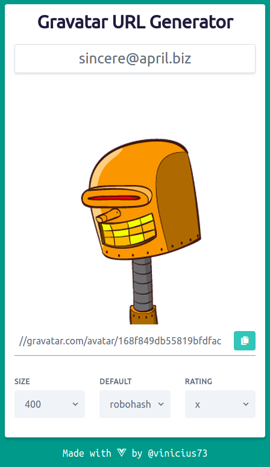

# Gravatar URL Generator

[](https://greenkeeper.io/)

A fun and friendly generator of Gravatar urls.  



https://vinicius73.github.io/gravatar-url-generator/

## Resources used

- [Vue.js (PWA)](https://vuejs.org)
- [Vue.js Router](https://router.vuejs.org)
- [vue-page-title](https://github.com/vinicius73/vue-page-title)
- [Tailwind CSS](https://tailwindcss.com)
- [Font Awesome](https://fontawesome.com)
- [blueimp-md5](https://www.npmjs.com/package/blueimp-md5)
- [Ubuntu Font](https://fonts.google.com/specimen/Ubuntu)

## Local run

```shell
yarn # npm install
yarn serve # npm run serve
```
